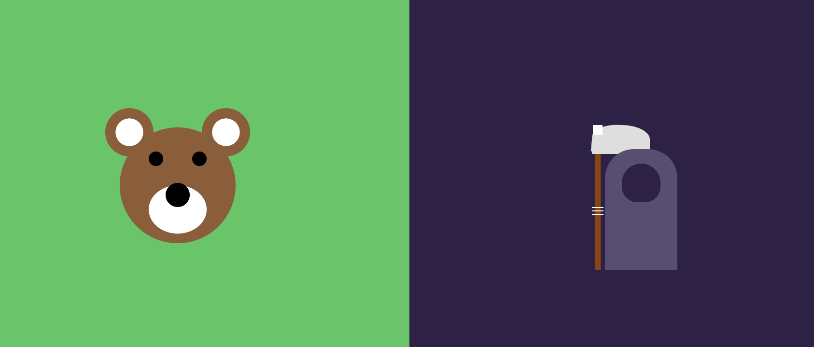
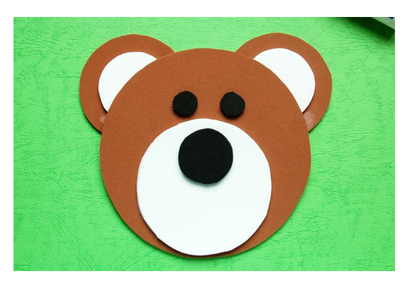
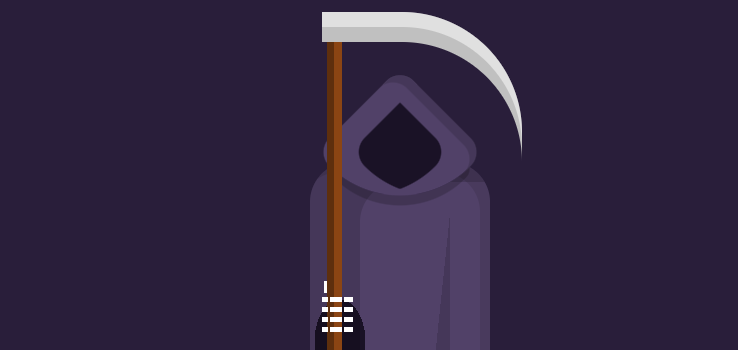

# Escena con solo uso de css
Para dar un poco de contexto, el bearReaper.css fue todo hecho por mí, pero la escena cuando presionas el oso te lleva a un messi.html que este si es código encontrado en internet lo mismo con al presionar el Reaper, también te lleva, pero a un demonio.html con un css que también fue encontrado en internet. Para que la escena se viera mejor hice eso.  
En el index veras la escena hecha por mi:

Cuando presionas el oso te lleva a una imagen de Messi (Esto si es encontrado en internet)
Cuando presionas la muerte te lleva a un demonio (Esto tambien es encontrado en internet)
## Para ver la escena desde el servidor:
https://221256.devng.online/lab4/

## Imagenes de inspiracion
En un principio pensaba hacer solo la imagen de un dibujo de Raytracing que se hizo para graficas:

Sin embargo se veia muy simple por lo que se agregara otra imagen a la escena. 

